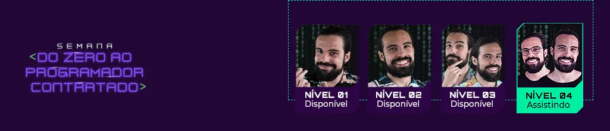
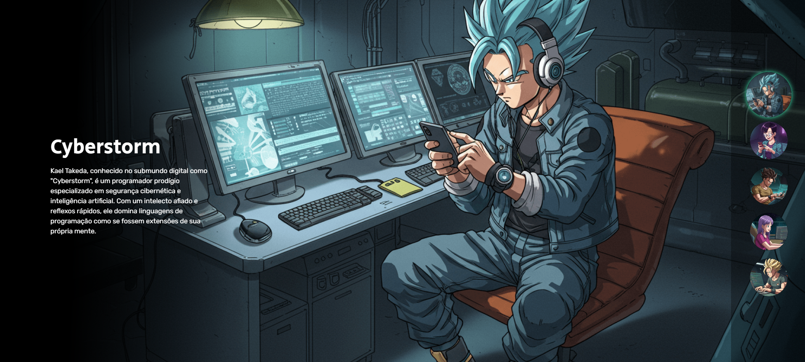

<!-- README.md -->

 

  

 
  
  

<h2>✨ Sobre</h2>

  Este é um projeto desenvolvido durante a semana Do Zero ao Programador Contratado, mentorado pelos irmãos gêmeos Beto e Cadu, criadores do Dev em Dobro. Durante a semana foram liberadas aulas e lives com fundamentos de HTML, CSS e JavaScript, de forma prática e divertida.

 

  

<h2>
📚 Aprendizado </h2>

<ul>
  <li>Fundamentos sólidos de HTML, CSS e JavaScript
  <li>Clean Code: Como escrever um código limpo, organizado e fácil de manter</li>
  <li>Dicas valiosas para o Github</li>
  <li>Introdução a Inteligência Artificial no front-end</li>
</ul>

<h2>📸 Captura de Tela</h2> 

  

<h2>📬 Contato</h2>

Email: guilherme.tavares.cavalcante@gmail.com

  LinkedIn: <a href="https://www.linkedin.com/in/guilhermeatc/">Guilherme Augusto</a>

<h1></h1>

<b>Obrigado por visualizar! 😁</b>
